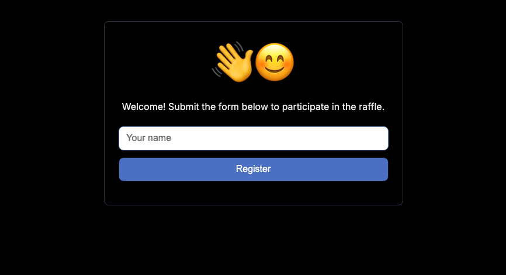
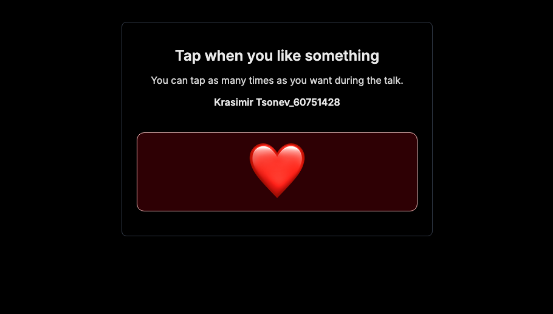
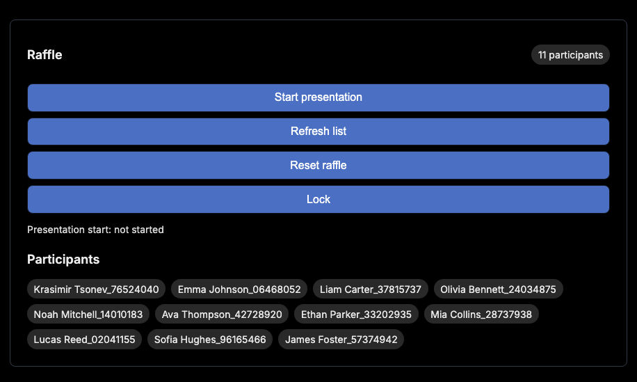
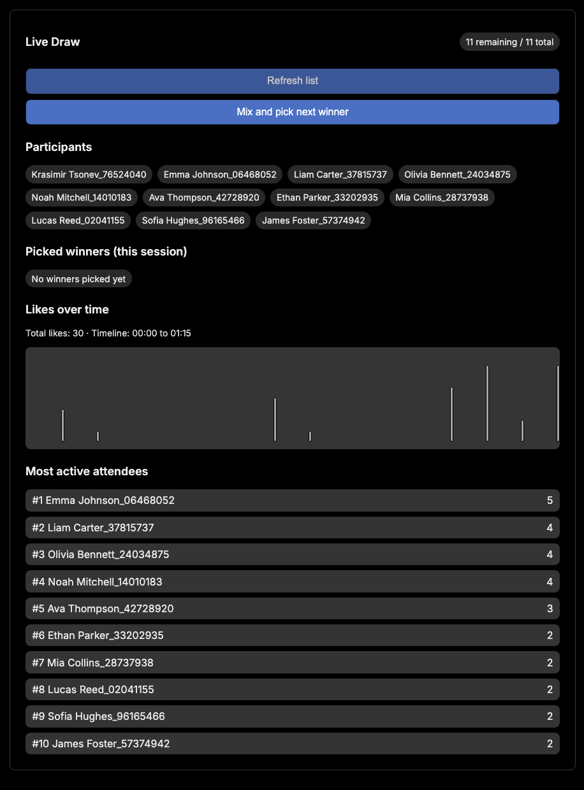

# Small website for raffles at talk events (conferences, meetups, etc).

- Attendees scan a QR code and register with name only.
- Each registration gets a generated participant name in the format `name_########`.
- Presenter starts the presentation timer, and runs a client-side random draw at the end.
- After registration, attendee is redirected to a like page with a big heart button. Likes are stored with elapsed time from presentation start, and shown in a timeline and leaderboard on live draw page.
- Data persists until presenter resets the raffle.

## Tech choices

- Backend: Node.js + Express
- Frontend: Vanilla JavaScript, HTML, CSS utility classes
- Storage: MongoDB only (configured via env vars or optional local `secrets/config.js`)

## Environment variables

- `PORT` (optional, default: `3000`)
- `PRESENTER_PIN` (required if `secrets/config.js` is not present)
- `MONGO_URI` (required if `secrets/config.js` is not present)
- `MONGO_DB_NAME` (optional, default: `raffle`)
- `MONGO_COLLECTION` (optional, default: `raffle_entries`)

You can use a local untracked file for development by copying:

```bash
cp secrets/config.example.js secrets/config.js
```

For Docker/Cloud Run, prefer environment variables.

Optional local `secrets/config.js` keys:

- `presenterPin`
- `mongo.uri`
- `mongo.dbName`
- `mongo.collection`

## Run locally

1. Install dependencies:

   ```bash
   npm install
   ```

2. Start app:

   ```bash
   npm start
   ```

   Or run without `secrets/config.js` by using env vars:

   ```bash
   PRESENTER_PIN=8225 MONGO_URI="<mongo-uri>" npm start
   ```

3. Open:
   - Registration: `http://localhost:3000/`
   - Like page (opened automatically after register): `http://localhost:3000/like`
   - Presenter: `http://localhost:3000/presenter`
   - Draw screen: `http://localhost:3000/screen/draw`
   - QR screen: `http://localhost:3000/screen/qr`

## Generate QR image

Create a QR PNG for the registration URL:

```bash
RAFFLE_PUBLIC_URL="https://your-domain.com/" npm run generate:qr
```

Output file defaults to `public/registration-qr.png`.

Optional custom output:

```bash
RAFFLE_PUBLIC_URL="https://your-domain.com/" QR_OUTPUT="public/my-qr.png" npm run generate:qr
```

## Docker

Run the container with env vars:

```bash
docker run --rm -p 3000:8080 \
   -e PRESENTER_PIN=8225 \
   -e MONGO_URI="<mongo-uri>" \
   -e MONGO_DB_NAME=raffle \
   -e MONGO_COLLECTION=raffle_entries \
   talk-raffle
```

## Iframe pages for presentation

- QR page: `/screen/qr`
- Draw page: `/screen/draw` (public, no `Reset raffle` or `Lock` buttons)
- Full presenter controls: `/presenter` (PIN protected; includes `Reset raffle`)

Example iframe snippets:

```html
<iframe src="https://your-domain.com/screen/qr" width="1280" height="720"></iframe>
```

```html
<iframe src="https://your-domain.com/screen/draw" width="1280" height="720"></iframe>
```

## Pages

- `GET /`
- `GET /like`
- `GET /presenter`
- `GET /screen/qr`
- `GET /screen/draw`

## API routes

- `POST /api/register`
- `GET /api/participants`
- `POST /api/like`
- `GET /api/likes-timeline`
- `GET /api/likes-leaderboard`
- `POST /api/presenter/auth`
- `POST /api/presenter/logout`
- `GET /api/presenter/participants`
- `GET /api/presenter/state`
- `POST /api/presenter/start`
- `GET /api/presenter/likes-timeline`
- `POST /api/presenter/reset`

## Notes

- Winner selection is client-side only (in `public/app.js`) after participants are loaded.
- Presenter starts the timer with `POST /api/presenter/start`; every like stores elapsed time from this start in MongoDB.
- Like button blocks repeated clicks while the current request is pending.
- `/screen/draw` supports multiple winners: each picked winner is stored in browser memory and excluded from subsequent draws.
- `/screen/draw` includes a simple likes-over-time chart (5-second buckets from presentation start).
- Current setup uses a repo file (`secrets/config.js`) for Mongo settings.

## Screenshots

### Registration screen

Attendees enter their name to join the raffle and receive a generated raffle identity.



### Like screen

After registration, attendees use the big heart button to send likes during the talk.



### Presenter screen

Presenter-only page for authentication, starting the presentation timer, and managing raffle controls.



### Draw screen

Public live draw screen with participants, winner picks, likes timeline, and activity leaderboard.



### QR screen

Presentation-friendly screen that shows the QR code for quick attendee registration.

